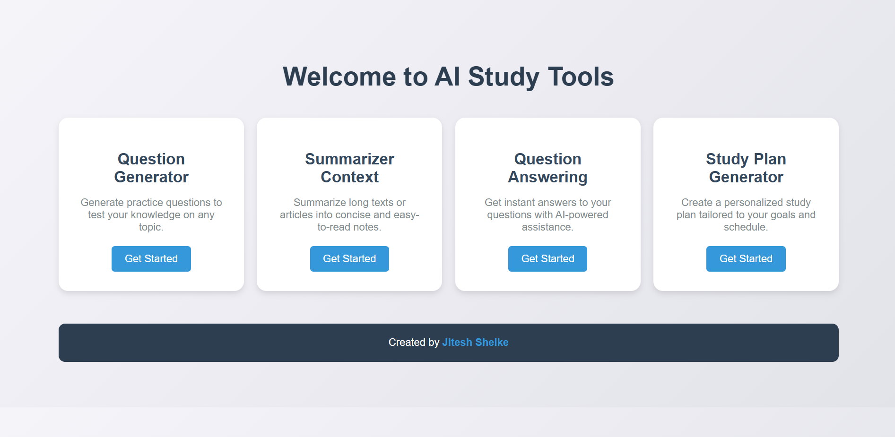
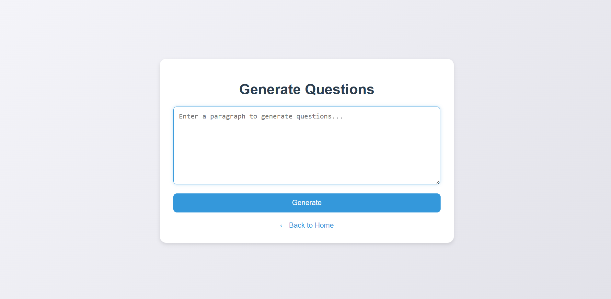
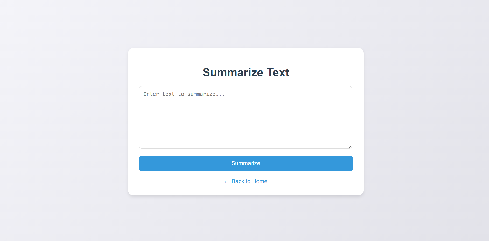
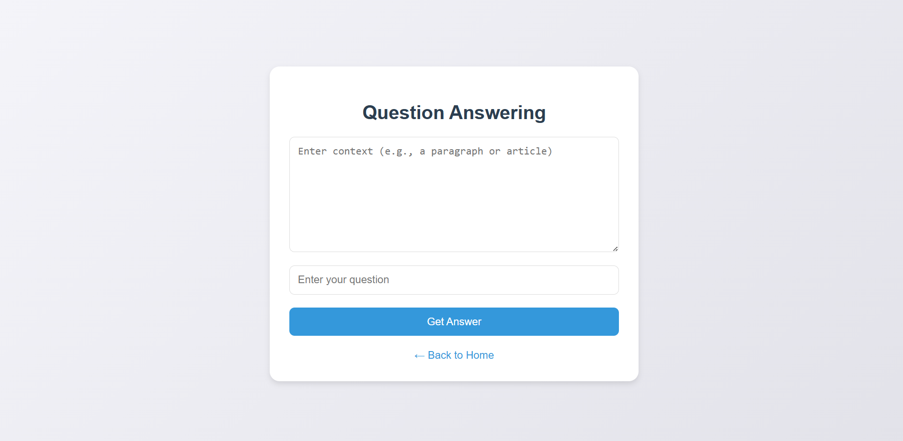
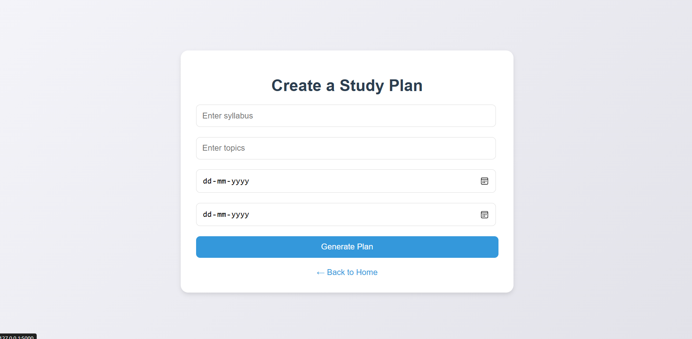

# 🧠 StudyMate AI — AI Study Assistant

AI-powered study assistant that summarizes notes, generates practice questions, answers questions, and creates structured study plans.

👤 Author

Mikhail Simanian — Computer Science Student
📍 Ottawa, Canada — Carleton University

GitHub:
https://github.com/mikhail0777

🔗 Project Links

⚠️ Note: This project runs locally using Python & Flask.

Repository:
https://github.com/mikhail0777/StudyMate-AI

🚀 Project Overview

StudyMate AI is a lightweight AI-powered study assistant that helps students process course material faster.

Users can paste lecture notes, textbook content, or study material and automatically generate:

• concise summaries
• practice questions
• contextual answers
• structured study plans

The goal of the project is to demonstrate how modern NLP tools can be integrated into a simple web application to improve learning workflows.

✨ Core Features
📄 Text Summarization

Convert long lecture notes into clear and concise summaries for faster revision.

❓ Practice Question Generator

Automatically generate review questions from study material to test understanding.

💬 Context-Based Question Answering

Ask questions about the text and receive AI-generated answers based on the context.

🧠 AI Study Plan Generator

Create structured study plans to organize revision sessions.

🌐 Simple Web Interface

Minimal UI built with Flask templates for quick experimentation.
---
## 🖼️ Screenshots

🔹 **Home Page**  

🔹 **Question Generator**  

🔹 **Summariezer Context** 

🔹 **Question Answering** 

🔹 **Study Plan Generator** 

🛠 Tech Stack

Backend

• Python
• Flask

AI / NLP

• Transformers
• Natural Language Processing models

Frontend

• HTML
• CSS
• JavaScript

📂 Project Structure
StudyMate-AI
│
├── app.py
├── templates/
├── static/
├── requirements.txt
└── README.md
⚙️ Installation

Clone the repository

git clone https://github.com/mikhail0777/StudyMate-AI.git
cd StudyMate-AI

Create a virtual environment

python -m venv venv

Activate it

Windows

venv\Scripts\activate

Mac / Linux

source venv/bin/activate

Install dependencies

pip install -r requirements.txt

Run the app

python app.py

Open in browser

http://127.0.0.1:5000
🎯 Example Use Cases

StudyMate AI can help students:

• summarize lecture notes before exams
• generate practice questions for revision
• quickly review large text blocks
• organize structured study sessions

📌 Notes

This project was built as a learning project to explore AI-powered educational tools and web development with Flask.
